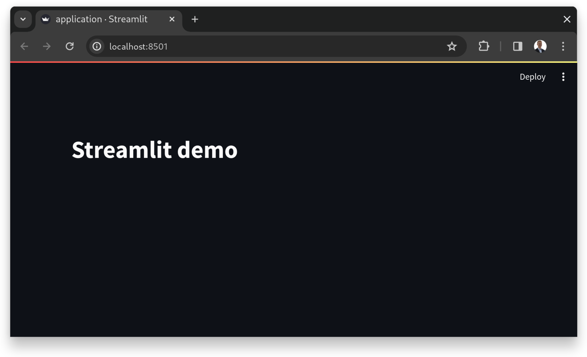
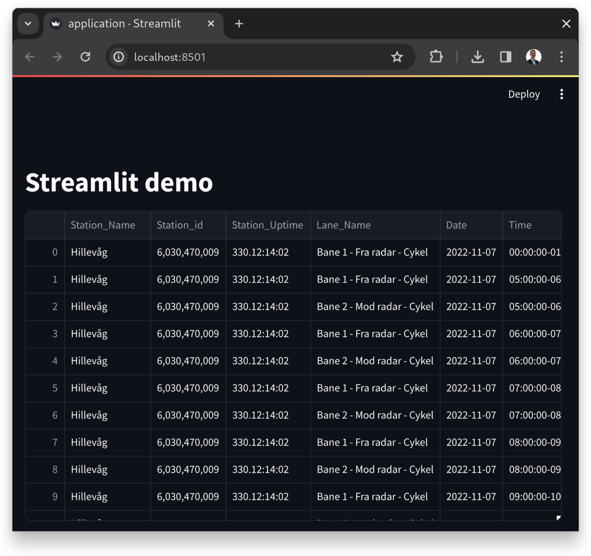
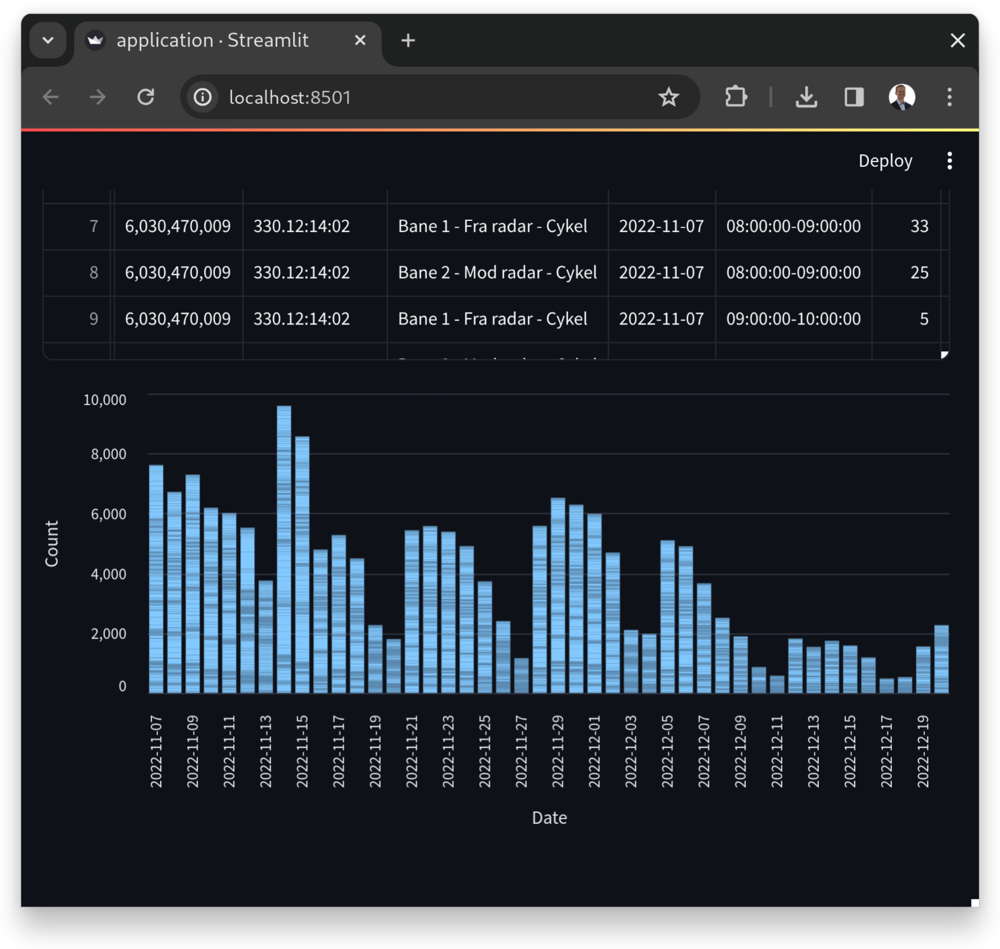

+++
title = "Quick and easy data web apps in Python with Streamlit"
date = "2024-04-06"

[extra]
comment = true

[taxonomies]
tags=["python"]
+++


> Bike counter along sykkelstamvegen in Stavanger. Photo by me!

I pretty recently switched jobs (from one IT consultancy to another).
This also meant switching client project, and subsequently I would be working with another tech stack than what I had been using the last few years.
I was going from microservices in csharp/.NET to "data apps" with Python, Pandas and Streamlit.

In order to prepare for the new project, I spent a week creating a [new hobby project](/projects/bike-count/) to play with the new tech stack.
I was surprised how little effort is needed to get from having a CSV file to having a working web application with interactive tables, charts and maps.
In this blog post I'll demonstrate how to get started with a data web app using Python, Pandas and Streamlit. It won't be very thorough.
If you want a deeper understanding, check out the official [streamlit.io/get-started](https://docs.streamlit.io/get-started) page.

### Setup / installation

> Note that I'm on a Fedora Linux computer using the bash shell.
> A few adjustments might be needed to follow along from Windows or Mac OS..

0. Create and navigate to a new empty project directory

1. Create and activate a new Python virtual environment within the project directory

   ```bash
   python -m venv .venv
   . .venv/bin/activate
   ```

   > Note: If you're using Linux and want to use another version of python than what `python` is installed/configured to be,
   > I have [some notes](https://notes.christianfosli.com/python.html#managing-multiple-python-versions-and-dependencies)

2. Install dependencies with pip

```bash
echo <<EOF > requirements.txt
streamlit~=1.33
pandas~=2.2
numpy~=1.26
EOF

pip install -r requirements.txt
```

### Create initial Streamlit app

Create a file application.py with the following content:

```python
import streamlit as st

st.title("Streamlit demo")
```

Run with

```bash
streamlit run application.py
```

This should open up the app in your default web browser:



That's the "Hello world" of Streamlit applications.
Now we're ready to explore some more features 😄.

### Dataframes

Dataframes are the primary data structure in the pandas library.
It is commonly used to store tabular data, i.e. data which consists of rows and columns, like spreadsheets do.

Streamlit makes it very simple visualize dataframes.

After some googling for a sort-of interesting dataset to play with, I found out Stavanger kommune publishes
[data from bike counter sensors publically](https://opencom.no/dataset/sykkeldata),
and the most recent dataset (as of April 2024) is available as [a CSV file here](
https://opencom.no/dataset/90cef5d5-601e-4412-87e4-3e9e8dc59245/resource/4c71d19a-adc4-42e0-9bed-c990316479be/download/sykkeldata.csv).
Unfortunately it's a bit outdated, data from 2022, but it will do for this demonstration.

Let's update application.py to demonstrate parsing this CSV to a dataframe and visualizing the results as a table:

```python
import pandas as pd
import streamlit as st

BIKE_COUNT_DATA_URL: str = (
    "https://opencom.no/dataset/90cef5d5-601e-4412-87e4-3e9e8dc59245/resource/4c71d19a-adc4-42e0-9bed-c990316479be/download/sykkeldata.csv"
)


@st.cache_data(ttl=3600)
def load_count_data() -> pd.DataFrame:
    df = pd.read_csv(BIKE_COUNT_DATA_URL)
    return df


st.title("Streamlit demo")

df = load_count_data()
st.dataframe(df)
```

And that's it!
Go back to your web browser and hit the "Rerun" button in the top right and notice we now have a fully interactive table of the dataset to play with!



### Plots

For a quick plotting demo, let's visualize bike counts (across all counter locations) by date.
We'll add a line to application.py:

```patch
@@ -16,3 +16,4 @@ st.title("Streamlit demo")

 df = load_count_data()
 st.dataframe(df)
+st.bar_chart(df, x="Date", y="Count")
```

And here we go:



Streamlit supports several different native chart types, as well as rendering charts from popular libraries from the ecosystem, such as matplotlib and plotly,
so there are lots of options and possibilities!

We could also use pandas to transform our dataframe in different ways prior to plotting the data, as needed.

### More

This was just the tip of the iceberg with regards to data apps on Streamlit.
Hopefully it was useful and/or inspires you to try it out and learn more 😄.

