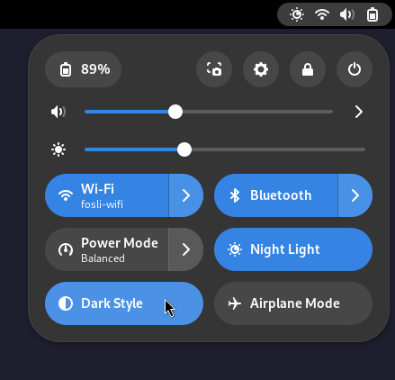
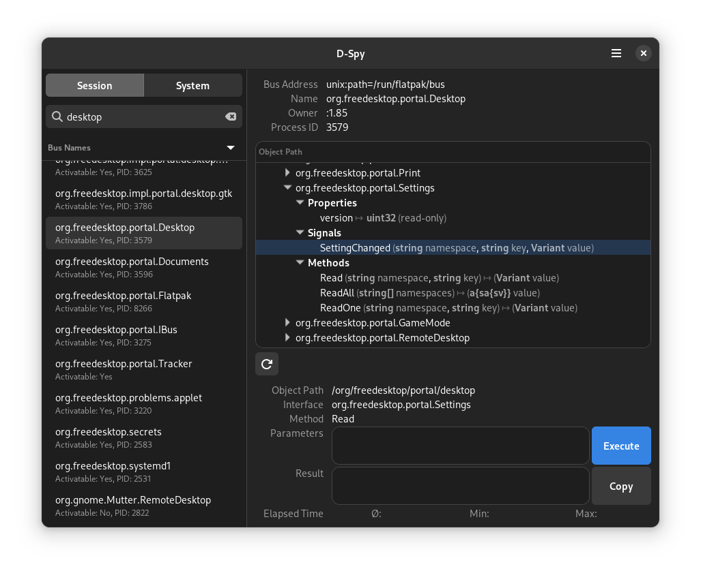
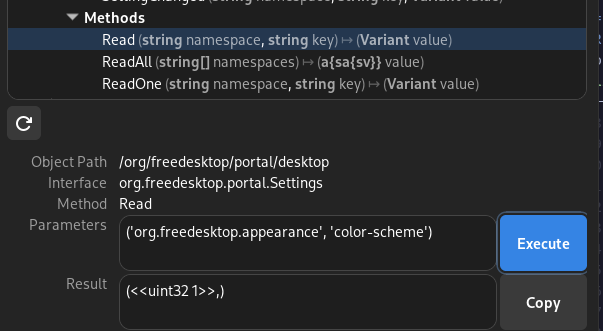

+++
title = "\"On-colorscheme-changed\" with rust and zbus"
date = "2024-01-23"
+++

My favorite terminal emulator at the time is [Alacritty](https://alacritty.org).
It's a super-performant minimalistic terminal written in rust.
One feature I wish it had but it doesn't is having the ability to quickly toggle between light and dark theme.

I usually want everything in dark mode, but occasionaly I get to do some programming outside in the sun in the summer,
or I'll do a demo in a meeting room with a not-that-bright projector, and then light mode makes the screen much easier to see.
I use Fedora Workstation on my laptop, and Gnome supports switching between dark and light mode with 1 click in the menu bar:



This blogpost illustrates how to write a rust service to listen for the system color scheme changing,
and updating themes for Alacritty terminal and Helix editor accordingly.

# Getting started with rust and tokio

* Create a new binary application with rust/cargo

```sh
cargo new on-colorscheme-changed
```

* Add required dependencies

```sh
cd on-colorscheme-changed
cargo add tokio -F full
```

* Adjust main.rs's hello world to use tokio:

```rust
use std::error::Error;

#[tokio::main]
async fn main() -> Result<(), Box<dyn Error>> {
    println!("Hello, world!");
    Ok(())
}
```

# D-Bus and zbus

[D-Bus](https://www.freedesktop.org/wiki/Software/dbus/) is a message bus system heavilly used on the Linux desktop.
Gnome settings publishes a message on D-Bus when the system color scheme changes,
and we can listen for this message in our rust-based service.

[zbus](https://dbus2.github.io/zbus/) is a Rust crate for D-Bus. It allows us to recieve and/or send messages over a D-Bus connection.

Let's add the required crates:

```sh
cargo add zbus futures-util
```

Looking at the zbus docs for [writing a client proxy](https://dbus2.github.io/zbus/client.html),
we see we can use "Trait-derived proxy call" to listen for our D-Bus message.
We'll start with this:

```rust
#[dbus_proxy(
    interface = "???",
    default_service = "???",
    default_path = "???"
 )]
trait Settings {
  // TODO: Add method about color scheme changing?
}
```

After some Googling I found a recommendation to install [D-Spy](https://flathub.org/apps/org.gnome.dspy) to explore D-Bus connections and figure out the details about which message we should listen for.
I also found some info about which message to listen for, but not quite enough details to fill out the missing data in the above snippet.

In D-Spy we find the relevant methods for us, under "org.freedesktop.portal.Desktop", in the "org.freedesktop.portal.Settings" interface:



The "SettingsChanged" signal is the most relevant for us, but let's start by executing the Read method directly within D-Spy to check what kind of response we can expect:



We see it responds with `1` for dark mode, and `0` for light mode.

Now we have enough info to "fill in the blanks" for our trait-derived proxy:

```rust
#[dbus_proxy(
    interface = "org.freedesktop.portal.Settings",
    default_service = "org.freedesktop.portal.Desktop",
    default_path = "/org/freedesktop/portal/desktop"
)]
trait Settings {
    #[dbus_proxy(signal)]
    fn setting_changed(namespace: &str, key: &str, value: OwnedValue) -> zbus::Result<()>;
}
```

and after looking through [writing a client proxy](https://dbus2.github.io/zbus/client.html) a few more times,
we're able to replace our "hello-world" with listening to the correct message (full main.rs at this point in time):

```rust
use futures_util::stream::StreamExt;
use std::error::Error;
use tokio::fs;

use zbus::{dbus_proxy, zvariant::OwnedValue, Connection};

#[dbus_proxy(
    interface = "org.freedesktop.portal.Settings",
    default_service = "org.freedesktop.portal.Desktop",
    default_path = "/org/freedesktop/portal/desktop"
)]
trait Settings {
    #[dbus_proxy(signal)]
    fn setting_changed(namespace: &str, key: &str, value: OwnedValue) -> zbus::Result<()>;
}

#[derive(Clone, Copy, Debug, PartialEq)]
enum ColorScheme {
    Light,
    Dark,
}

#[tokio::main]
async fn main() -> Result<(), Box<dyn Error>> {
    let conn = Connection::session().await?;
    let settings = SettingsProxy::new(&conn).await?;
    let mut settings_changed = settings
        .receive_setting_changed_with_args(&[
            (0, "org.freedesktop.appearance"),
            (1, "color-scheme"),
        ])
        .await?;

    println!("Connected to dbus! Waiting for changes...");

    while let Some(setting) = settings_changed.next().await {
        if let Ok(args) = setting.args() {
            let val = TryInto::<u32>::try_into(args.value)?;
            match val {
                0 => on_colorscheme_changed(ColorScheme::Light).await?,
                1 => on_colorscheme_changed(ColorScheme::Dark).await?,
                _ => panic!("Unexpected value"),
            };
        } else {
            eprintln!("{:?}", setting.args());
        }
    }

    Ok(())
}

async fn on_colorscheme_changed(cs: ColorScheme) -> Result<(), Box<dyn Error>> {
  // TODO: Do something useful
  Ok(())
}
```

# Updating color themes

Now we just need to implement the `on_colorscheme_changed` to do what we want.
This is of course a personal preference, but I'll do two things: change theme for helix editor and alacritty terminal.

Let's first add the [dirs crate](https://crates.io/crates/dirs), which makes it easier to find the correct config files to update:

```sh
cargo add dirs
```

1. Change theme for [helix editor](https://helix-editor.com/) from "catppucin_mocha" to "catpuccin_latte".
   I'll do this with a "find-and-replace" in my helix config file:

   ```rust
    let mut from_fname = dirs::config_dir().unwrap();
    let mut to_fname = 
    let (from, to) = if cs == ColorScheme::Light {
        ("catppuccin_mocha", "catppuccin_latte")
    } else {
        ("catppuccin_latte", "catppuccin_mocha")
    };

    let mut helix_conf_file = dirs::config_dir().unwrap();
    helix_conf_file.push("helix/config.toml");
    let helix_conf = fs::read_to_string(&helix_conf_file).await?;

    println!("Updating helix config to {cs:?}");
    let helix_conf = helix_conf.replace(from, to);
    fs::write(helix_conf_file, &helix_conf).await?;
   ```

2. Change theme for alacritty config, also from catppuccin mocha to catppuccin latte.

   Alacritty's theme configuration is a bit more verbose than helix's.
   It requires specifying each color, rather than just the theme name (basically just copying the theme "content" into alacritty.toml).
   Therefore we can't just find-and-replace the theme name.
   Instead I made two config files, alacritty.toml and alacritty.light.toml.
   We'll make our rust service swap these to alacritty.toml and alacritty.dark.toml when switching to light mode (and vice versa):

  ```rust
    if cs == ColorScheme::Light {
        from_fname.push("alacritty/alacritty.light.toml");
        to_fname.push("alacritty/alacritty.dark.toml");
    } else {
        from_fname.push("alacritty/alacritty.dark.toml");
        to_fname.push("alacritty/alacritty.light.toml");
    };

    println!("Updating alacritty.toml to {cs:?}");
    let mut alacritty_conf_file = dirs::config_dir().unwrap();
    alacritty_conf_file.push("alacritty/alacritty.toml");
    fs::rename(&alacritty_conf_file, &to_fname).await?;
    fs::rename(&from_fname, &alacritty_conf_file).await?;
    ```

Finally, I realized that the `setting_changed` signal fires twice when changing system color scheme,
so I had to adjust the above snippets so that they wouldn't crash when they're called the second time
(basically just add an if condition).

Here is my complete function:

```rust
async fn on_colorscheme_changed(cs: ColorScheme) -> Result<(), Box<dyn Error>> {
    println!("Colorscheme changed: {cs:?}");

    let (from, to) = if cs == ColorScheme::Light {
        ("catppuccin_mocha", "catppuccin_latte")
    } else {
        ("catppuccin_latte", "catppuccin_mocha")
    };

    let mut helix_conf_file = dirs::config_dir().unwrap();
    helix_conf_file.push("helix/config.toml");
    let helix_conf = fs::read_to_string(&helix_conf_file).await?;

    if helix_conf.contains(from) {
        println!("Updating helix config to {cs:?}");
        let helix_conf = helix_conf.replace(from, to);
        fs::write(helix_conf_file, &helix_conf).await?;
    } else {
        println!("helix config did not contain {from}. Nothing to do.");
    }

    let mut from_fname = dirs::config_dir().unwrap();
    let mut to_fname = dirs::config_dir().unwrap();
    if cs == ColorScheme::Light {
        from_fname.push("alacritty/alacritty.light.toml");
        to_fname.push("alacritty/alacritty.dark.toml");
    } else {
        from_fname.push("alacritty/alacritty.dark.toml");
        to_fname.push("alacritty/alacritty.light.toml");
    };

    if fs::try_exists(&from_fname).await.is_ok_and(|val| val) {
        println!("Updating alacritty.toml to {cs:?}");
        let mut alacritty_conf_file = dirs::config_dir().unwrap();
        alacritty_conf_file.push("alacritty/alacritty.toml");
        fs::rename(&alacritty_conf_file, &to_fname).await?;
        fs::rename(&from_fname, &alacritty_conf_file).await?;
    } else {
        println!("File {from_fname:?} not found. Nothing to do.");
    }

    Ok(())
}
```

# Running as a systemd service

To top it off, we'll write a service file such that our service can be run automatically in the background using systemd:

```service
[Unit]
Description=On system colorscheme changed - update config files for terminal-based applications
Requires=dbus.service
After=dbus.service

[Service]
ExecStart=/bin/bash -c on-colorscheme-changed
Type=simple
Restart=on-failure

[Install]
WantedBy=default.target
```

Save it as "on-colorscheme-changed.service", or something similar.

Finally, we'll build our binary and enable the systemd service:

```sh
cargo install --locked --path . # also ensure ~/.cargo/bin is in $PATH
systemctl --user enable ./on-colorscheme-changed.service
# The above command only works nicely on Fedora 39, otherwise you can copy/symlink it to ~/.config/systemd/user
systemctl --user start on-colorscheme-changed
```

# Result

Here we can see my terminal emulator automatically switches theme when I toggle my system's color scheme:

<video controls src="result_demo.webm">
</video>

You can see the finished rust service on my GitHub at [christianfosli/on-colorscheme-changed](https://github.com/christianfosli/on-colorscheme-changed)
