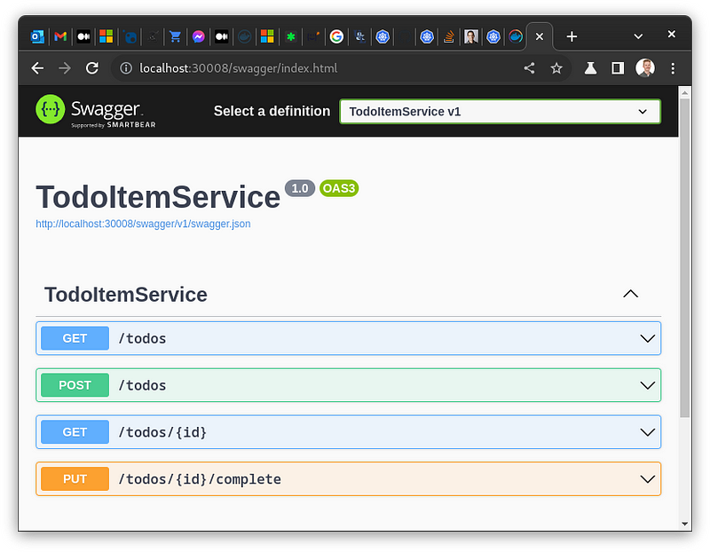
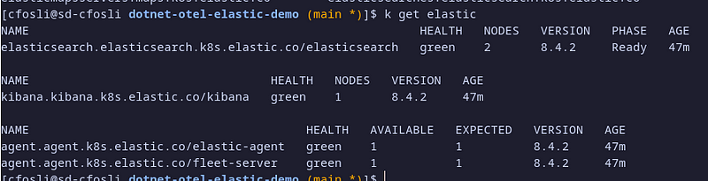
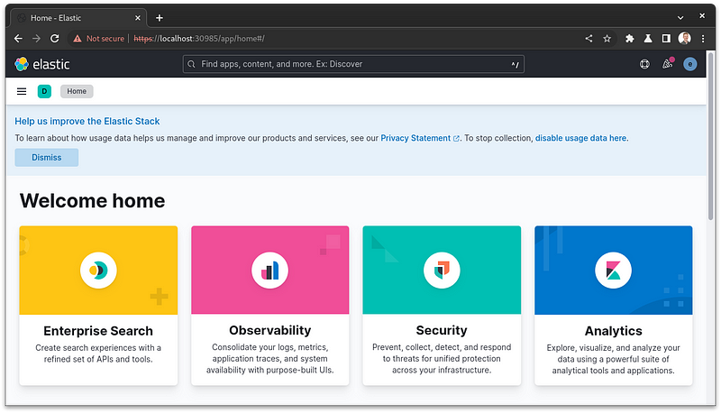
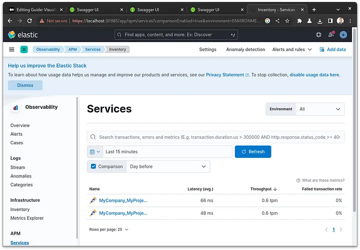
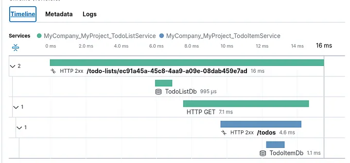
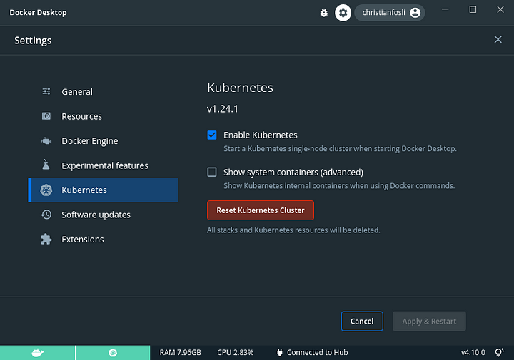

+++
title = "Visualisere telemetridata fra .NET mikrotjenester med OpenTelemetry, ElasticSearch, Kibana"
date = "2022-10-24"
+++

<div class="fig-container">
<figure>
  
  <figcaption>
  <p>Photo by <a href="https://unsplash.com/@laughayette?utm_content=creditCopyText&utm_medium=referral&utm_source=unsplash">Marten Newhall</a> on <a href="https://unsplash.com/photos/person-using-magnifying-glass-enlarging-the-appearance-of-his-nose-and-sunglasses-uAFjFsMS3YY?utm_content=creditCopyText&utm_medium=referral&utm_source=unsplash">Unsplash</a><p/>
  </figcaption>
</figure>
</div>

> Note: I originally wrote this blog post [on medium](https://medium.com/@cfosli/visualisere-telemetridata-fra-net-mikrotjenester-med-opentelemetry-elasticsearch-kibana-c4121c8b68e4).
> It is written in norwegian because it was meant for a community blog with mostly norwegian readers

I prosjektet jeg arbeider med for tiden har vi flere mikrotjenester skrevet i .NET. Vi ønsket å få bedre innsikt i ytelse til mikrotjenestene og deres endepunkt, helst uten å bruke plattform spesifikke løsninger hos en spesifikk skyleverandør.
Vi benyttet allerede ElasticSearch og Kibana for å samle og visualisere logger, så det var praktisk å kunne visualisere annen telemetridata i samme løsning.

Denne guiden viser hvordan man kan gjøre nettopp dette: Samle og eksportere telemetridata, spesielt "traces", ved hjelp av Open Telemetry sine .NET biblioteker, og visualisere dataen i Kibana.

I denne guiden vil vi kjøre både .NET-mikrotjenestene og elastic tjenestene i Kubernetes. For å holde det enklest mulig vil vi kjøre alt lokalt i samme kubernetes cluster via Docker Desktop.

Hvordan man kjører mikrotjenestene (om man bruker kubernetes, en PaaS løsning hos en skyleverandør, eller en "tradisjonell" VM) har lite å si med tanke på OpenTelemetry.
Det som er viktig er at mikrotjenestene kan nå endepunktet som telemetridataen skal eksporteres til.

# Forutsetninger

Guiden tar utgangspunkt i at man har Docker Desktop installert, og har slått på Kubernetes funksjonaliteten der.
Git, helm, curl, jq og .NET 6 SDK er også fint å ha, i tillegg til en konsoll/terminal med bash eller tilsvarende.

# Utgangspunkt

Før vi kan sette igang med OpenTelemetry trenger vi noe å monitorere.
Jeg har tatt utgangspunkt i 2 enkle mikrotjenester for å jobbe med "TODO's".
TodoListService lar oss opprette og hente ut TODO-lister, mens TodoItemService lar oss opprette og fullføre enkelte oppgaver.

Jeg tok også med en kubernetes deployment for å kjøre en MS SQL Server database.
En slik deployment fungerer fint for å teste monitorering av databasekall, men er absolutt ikke klar for produksjonbruk!

[Diagram (flyttes til inline picture)](https://cdn-images-1.medium.com/v2/resize:fit:800/1*vY-pZjqbr8dl7k0P4ZG3yg.png)

Hent ned startkoden på GitHub:

```sh
git clone https://github.com/christianfosli/dotnet-otel-elastic-demo
cd dotnet-otel-elastic-demo
git switch before-otel
```

Påse at docker-desktop er satt som aktivt kubernetes context

```sh
kubectl config use-context docker-desktop
```

Bygg og kjør tjenestene i ditt lokale kubernetes cluster:

```sh
./scripts/build-and-run.sh
```

Scriptet bygger tjenestene våre med docker, oppretter og bytter til ett kubernetes namespace "dotnet-otel-elastic",
og deployer MS SQL og de to tjenestene til kubernetes.

Om kort tid skal du kunne nå tjenestene lokalt. Sjekk at tjenestene kjører og er tilgjengelige:

```sh
kubectl get deploy
# skal vise 3 deployments med "READY 1/1"
kubectl get svc
# skal vise 3 services, hvor todo-item-svc og todo-list-svc er
# av type NodePort og PORT(S) 80:30008 / 80:30009
# det vil si de er bundet til din localhost port :30008 og :30009
```

Åpne http://localhost:30008/swagger eller http://localhost:30009/swagger i nettleseren din for å teste API'ene med Swagger UI.
Opprett gjerne en TodoList og ett par ToDo's.



# Steg 1- Kjøre ElasticSearch, Kibana og APM i Kubernetes

> ⚠️ Note: Hvis du skippet "Utgangspunkt" seksjonen kan det være lurt å sjekke hvilket kubernetes cluster du er koblet til før du fortsetter.
> Sjekk `kubectl config current-context`.

Nå som mikrotjenestene er oppe å kjører trenger vi ett sted hvor vi kan samle og visualisere monitoreringsdata.
Det finnes mange måter å kjøre elastic tjenestene på.
Jeg har valgt å kjøre dem i kubernetes.

Først installerer vi Elastic Cloud on Kubernetes operatoren med helm:

```sh
helm repo add elastic https://helm.elastic.co
helm repo update
helm install elastic-operator elastic/eck-operator -n elastic-system --create-namespace
```

Deretter skal vi legge til ElasticSearch, Kibana, Fleet-Server og Elastic-Agent med APM integrasjonen.
Vi tar utgangspunkt i ett forslag fra Elastic (ref elastic sine nettsider):

```sh
curl https://raw.githubusercontent.com/elastic/cloud-on-k8s/2.4/config/recipes/elastic-agent/fleet-apm-integration.yaml \
> ./infra/elastic-stack.yaml
```

Vi gjør noen endringer slik at det passer bedre å kjøre lokalt i Docker Desktop, i "dotnet-otel-elastic" namespace, og slik at vi kan nå Kibana utenfor clusteret:

```patch
diff --git a/infra/elastic-stack.yaml b/infra/elastic-stack.yaml
index 538eaa3..de68b23 100644
--- a/infra/elastic-stack.yaml
+++ b/infra/elastic-stack.yaml
@@ -1,15 +1,19 @@
 apiVersion: kibana.k8s.elastic.co/v1
 kind: Kibana
 metadata:
   name: kibana
 spec:
   version: 8.4.2
   count: 1
   elasticsearchRef:
     name: elasticsearch
+  http:
+    service:
+      spec:
+        type: NodePort
   config:
-    xpack.fleet.agents.elasticsearch.hosts: ["https://elasticsearch-es-http.default.svc:9200"]
-    xpack.fleet.agents.fleet_server.hosts: ["https://fleet-server-agent-http.default.svc:8220"]
+    xpack.fleet.agents.elasticsearch.hosts: ["https://elasticsearch-es-http:9200"]
+    xpack.fleet.agents.fleet_server.hosts: ["https://fleet-server-agent-http:8220"]
     xpack.fleet.packages:
     - name: system
       version: latest
@@ -58,15 +62,23 @@
 ---
 apiVersion: elasticsearch.k8s.elastic.co/v1
 kind: Elasticsearch
 metadata:
   name: elasticsearch
 spec:
   version: 8.4.2
   nodeSets:
   - name: default
-    count: 3
+    count: 2
     config:
       node.store.allow_mmap: false
+    podTemplate:
+      spec:
+        containers:
+        - name: elasticsearch
+          resources:
+            limits:
+              memory: 1Gi
+            requests:
+              memory: 1Gi
 ---
 apiVersion: agent.k8s.elastic.co/v1alpha1
 kind: Agent
@@ -144,7 +163,6 @@ apiVersion: v1
 kind: ServiceAccount
 metadata:
   name: fleet-server
-  namespace: default
 ---
 apiVersion: rbac.authorization.k8s.io/v1
 kind: ClusterRoleBinding
@@ -153,7 +171,7 @@ metadata:
 subjects:
 - kind: ServiceAccount
   name: fleet-server
-  namespace: default
+  namespace: dotnet-otel-elastic
 roleRef:
   kind: ClusterRole
   name: fleet-server
```

Så legger vi elastic tjenestene inn i Kubernetes clusteret vårt

```sh
kubectl apply -f infra/elastic-stack.yaml
```

Sjekk hvordan det går:

```sh
kubectl get elastic
```

Når alt viser Health "green" lover det bra!



Nå kan vi åpne kibana. Vi trenger bare ett portnummer og ett passord til innlogging:

```sh
kubectl get svc # noter portnummer for kibana-kb-http (3****)
kubectl get secret elasticsearch-es-elastic-user -o json \
  | jq -r .data.elastic | base64 -d # kopier passord
```

Åpne https://localhost:3**** i en nettleser og logg på med brukernavn "elastic" og passordet vi fant over.



Nå har vi infrastrukturen på plass i vårt lokale kubernetes cluster. Vi er klar for å monitorere tjenestene våre!

# Steg 2 - Oppdatere mikrotjenestene til å generere telemetridata og eksportere til elastic APM

Først må vi installere relevante OpenTelemetry NuGet bibliotek. Åpne TodoListService mappen i en terminal og skriv følgende kommandoer.


```sh
dotnet add package --prerelease OpenTelemetry.Extensions.Hosting
dotnet add package --prerelease OpenTelemetry.Instrumentation.AspNetCore
dotnet add package --prerelease OpenTelemetry.Instrumentation.Http
dotnet add package --prerelease OpenTelemetry.Instrumentation.SqlClient
dotnet add package OpenTelemetry.Exporter.OpenTelemetryProtocol
```

(eller installer de samme pakkene med NuGet package manager i Visual Studio / din favoritt IDE om du foretrekker det 😊)

I skrivende stund er en del av bibliotekene kun tilgjengelig som “prerelease”, dette pga de baserer seg på OpenTelemetry konvensjoner som ikke enda er helt ferdig spesifiserte, derfor må vi ha med “ — prerelease”.

Så oppdaterer vi Program.cs til å bruke bibliotekene vi installerte til å sende OpenTelemetry traces.

```patch
diff --git a/TodoListService/Program.cs b/TodoListService/Program.cs
index daf96c7..84adb0c 100644
--- a/TodoListService/Program.cs
+++ b/TodoListService/Program.cs
@@ -1,6 +1,8 @@
 using System.Text.Json;
 using Microsoft.AspNetCore.Mvc;
 using Microsoft.EntityFrameworkCore;
+using OpenTelemetry.Resources;
+using OpenTelemetry.Trace;
 
 var builder = WebApplication.CreateBuilder(args);
 
@@ -11,6 +13,13 @@ builder.Services.AddHttpClient<TodoItemService>(opt => opt.BaseAddress = new Uri
 builder.Services.AddEndpointsApiExplorer();
 builder.Services.AddSwaggerGen();
 
+builder.Services.AddOpenTelemetryTracing(otelBuilder => otelBuilder
+    .SetResourceBuilder(ResourceBuilder.CreateDefault().AddService(serviceName: "MyCompany.MyProject.TodoListService"))
+    .AddAspNetCoreInstrumentation()
+    .AddHttpClientInstrumentation()
+    .AddSqlClientInstrumentation()
+    .AddOtlpExporter());
+
 var app = builder.Build();
 
 app.UseSwagger();
```

Så oppdaterer vi kubernetes deploymenten med addresse og protokoll til elastic APM.

```patch
diff --git a/TodoListService/deploy.yaml b/TodoListService/deploy.yaml
index f1ebc0e..55e799e 100644
--- a/TodoListService/deploy.yaml
+++ b/TodoListService/deploy.yaml
@@ -14,7 +14,7 @@ spec:
     spec:
       containers:
       - name: todolist
-        image: todo-list:before-otel
+        image: todo-list:latest
         imagePullPolicy: Never # Build with docker desktop
         ports:
         - containerPort: 80
@@ -26,6 +26,12 @@ spec:
               key: SA_PASSWORD
         - name: DbConnectionString
           value: Server=tcp:mssql-svc; Database=TodoListDb; User Id=sa; Password=$(DB_PASSWORD);
+        - name: OTEL_EXPORTER_OTLP_ENDPOINT
+          value: http://apm:8200
+        - name: OTEL_EXPORTER_OTLP_PROTOCOL
+          value: grpc
+        - name: OTEL_RESOURCE_ATTRIBUTES
+          value: "deployment.environment=local"
 ---
 apiVersion: v1
 kind: Service
```

Bygg og deploy endringene til kubernetes

```sh
cd TodoListService
docker build -t todo-list:latest .
kubectl apply -f deploy.yaml
```

Repeter samme steg for TodoItemService.

# Test og resultat

Gjør ett par requests via Swagger UI på http://localhost:30008/swagger og http://localhost:30009/swagger.

Så åpner vi APM applikasjonen i Kibana. “Under Services” får vi en oversikt over mikrotjenestene.



Under traces kan vi gå videre inn på hver enkelt request. Timeline viser oss akkurat hva som tar tid.



# Oppryddning

For å slette det vi har laget her fra ditt lokale kubernetes cluster

```sh
kubectl delete -f ./infra/elastic-stack.yaml
kubectl delete namespace dotnet-otel-elastic
helm uninstall elastic-operator -n elastic-system
kubectl delete namespace elastic-system
```

Eller hvis du ikke har noe annet du vil ta vare på i ditt lokale kubernetes cluster kan du klikke “Reset Kubernetes Cluster” i Docker-Desktop settings.



# Kilder

* [https://opentelemetry.io/docs/instrumentation/net/](https://opentelemetry.io/docs/instrumentation/net/)

* [https://www.elastic.co/guide/en/cloud-on-k8s/current/k8s-elastic-agent-fleet.html](https://www.elastic.co/guide/en/cloud-on-k8s/current/k8s-elastic-agent-fleet.html)


